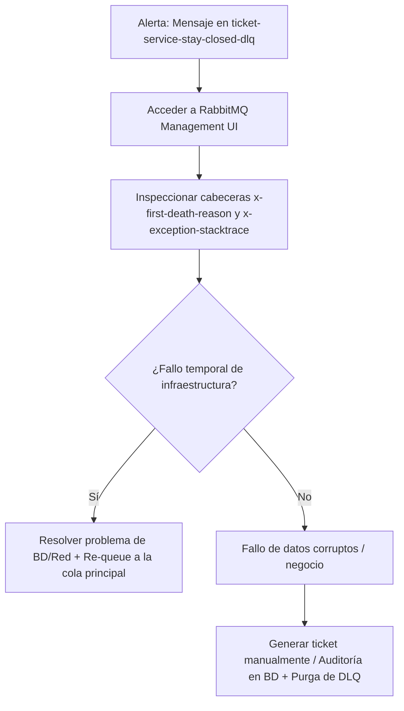

# Protocolo Operacional de Dead Letter Queue (DLQ) — `ticket-service`

Este documento establece el procedimiento operativo, responsabilidades e impacto funcional cuando un mensaje acaba en la **Dead Letter Queue (DLQ)** de `ticket-service`.

---

## 1. Contexto e Impacto de Negocio

* **Cola Principal:** `ticket-service-stay-closed-queue`
* **Dead Letter Exchange (DLX):** `ticket-service-stay-closed-dlx`
* **Dead Letter Queue (DLQ):** `ticket-service-stay-closed-dlq`
* **Evento procesado:** `StayClosedEvent` (Cierre de estancia de un vehículo).

### 🚨 Impacto de un mensaje en la DLQ:
Un mensaje en la DLQ de `ticket-service` representa un **recibo/ticket de cobro que no ha sido emitido ni guardado en la base de datos**.
- **Riesgo:** Pérdida de registro contable / facturación de la estancia finalizada.
- **Causa típica:** Fallos de datos no recuperables (ej. inconsistencia grave) o caída persistente de la infraestructura tras agotar los 6 reintentos automáticos con backoff exponencial (~25 segundos de ventana total).

---

## 2. Roles y Responsabilidades

* **Responsable de la revisión:** Equipo de Operaciones / Soporte L2 / Administrador del Sistema.
* **Mecanismo de Monitoreo:** 
  - Alerta configurada en Grafana / Prometheus o consola de RabbitMQ cuando la métrica `rabbitmq_queue_messages{queue="ticket-service-stay-closed-dlq"}` sea `> 0`.

---

## 3. Protocolo de Diagnóstico y Resolución

Cuando un mensaje llega a la DLQ, el operador **NO** puede dejar el mensaje sin procesar. Se debe seguir este flujo:



### Paso 1: Inspección del Mensaje
1. Acceder a la interfaz de RabbitMQ Management UI (`http://localhost:15672` o consola de staging/producción).
2. Seleccionar la cola `ticket-service-stay-closed-dlq`.
3. Hacer clic en **"Get Message(s)"** para ver el contenido del mensaje y sus cabeceras.
4. Revisar la cabecera `x-first-death-reason` (motivo de rechazo de RabbitMQ) y `x-exception-stacktrace` / `x-exception-message` (adjuntada por `RepublishMessageRecoverer` en Spring AMQP) para identificar la causa raíz exacta.

### Paso 2: Acción Correctora

#### Opción A: Fallo de Infraestructura Temporal (ej. BD fuera de servicio brevemente)
Si la causa fue una caída de base de datos que ya ha sido resuelta:
1. Usar la funcionalidad de **Move Messages** (o reenviar mediante la UI/script) desde `ticket-service-stay-closed-dlq` hacia la cola principal `ticket-service-stay-closed-queue`.
2. Verificar en los logs de `ticket-service` que el mensaje se ha procesado con éxito.
*Nota sobre tiempo de consumo:* Con 6 intentos y backoff exponencial, cada mensaje problemático consume ~25 s en total (1s + 2s + 4s + 8s + 10s). El servicio tiene configurada una concurrencia de 3 a 5 hilos de consumidor (`concurrency=3`, `max-concurrency=5`) para evitar paralizar el procesamiento de otros mensajes válidos durante ese intervalo.

#### Opción B: Fallo por Datos Inconsistentes o Corruptos
Si el mensaje no se puede procesar automáticamente debido a datos corruptos:
1. Extraer los datos del evento (`stayId`, `exitDate`, `totalAmount`).
2. Insertar/regularizar el ticket manualmente mediante la API administrativa o script SQL de soporte.
3. Registrar la incidencia en la bitácora de auditoría de operaciones.
4. Eliminar/purgar el mensaje corregido de la DLQ.

---

## 4. Notas de Despliegue y Migración

### ⚠️ Re-declaración de Cola Existente en RabbitMQ (`PRECONDITION_FAILED`)
Dado que la cola `ticket-service-stay-closed-queue` se declaró originalmente sin argumentos de DLQ, RabbitMQ no permite modificar los argumentos de una cola existente sobre la marcha y responderá con el error `PRECONDITION_FAILED` al arrancar el servicio si la cola ya existe en el broker.

**Opción 1: Eliminación previa de la cola (recomendado si no hay mensajes en vuelo)**
```bash
docker exec parking-rabbitmq rabbitmqctl delete_queue ticket-service-stay-closed-queue
```
O desde RabbitMQ Management UI (`http://localhost:15672`) -> **Queues** -> Seleccionar `ticket-service-stay-closed-queue` -> **Delete Queue**.

**Opción 2: Aplicación mediante Policy en RabbitMQ (sin borrado de cola)**
```bash
docker exec parking-rabbitmq rabbitmqctl set_policy ticket-dlq "^ticket-service-stay-closed-queue$" \
  '{"dead-letter-exchange":"ticket-service-stay-closed-dlx", "dead-letter-routing-key":"ticket-service-stay-closed-dead-letter"}' \
  --apply-to queues
```

*Nota sobre retenimiento:* La cola DLQ `ticket-service-stay-closed-dlq` no se configura con TTL ni `x-max-length` para garantizar que ningún evento no procesado caduque o se pierda antes de la revisión por Soporte L2.
